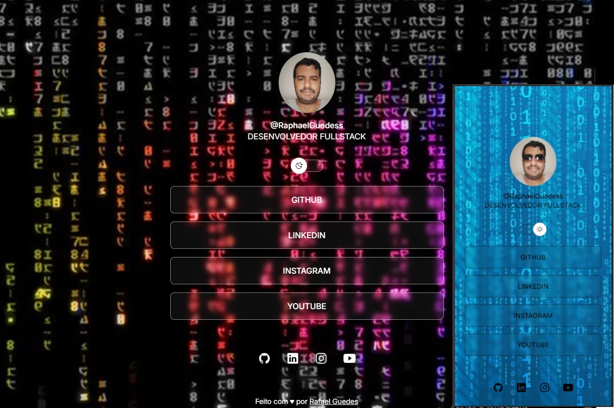

<h1 align="center"> PROJETO START </h1>

Programa exclusivo e gratuito, promovido por Rafael Guedes para divulgação de projetos

  <a href="#-tecnologias">Tecnologias</a>&nbsp;&nbsp;&nbsp;|&nbsp;&nbsp;&nbsp;
  <a href="#-projeto">Projeto</a>&nbsp;&nbsp;&nbsp;|&nbsp;&nbsp;&nbsp;
  <a href="#-layout">Layout</a>&nbsp;&nbsp;&nbsp;|&nbsp;&nbsp;&nbsp;
   <a href="#memo-licença">Licença</a>

  

 

  

## 🚀 Tecnologias

Esse projeto foi desenvolvido com as seguintes tecnologias:

- HTML e CSS
- JavaScript
- Git e Github
- Figma

## 💻 Projeto

O PROJETO START é um agregador de links para usar como cartão de visitas online.

---

Feito com ♥ by Rafael Guedes :wave: [Participe da nossa comunidade!](https://discord.gg/rocketseat)